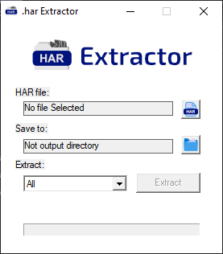

## Web Archive (.har) Extractor

### Version 1.0

This thing does exactly what you think of it. 

It extracts files from `.har` as any ordinary archiver would extract from any ordinary archive.

I hate writing readmes and it does not need a wall of text.

Interface:

[Download package 📦](bin/unhar-1.0.0.zip)