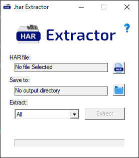

## Web Archive (.har) Extractor

<https://gitlab.com/maddsua/harextract>

### Version 3.2 (CLI)

Usage: `unhar -i [har_file.har] -o [output_dir] -m [mime_filter] -f [format_filter]`

`-w` - allow file overwrite

`-s` - silent (non-verbose)

`-j` - do not post-process text files

### Version 1.1 (last GUI, 'discounted')

This thing does exactly what you think of it. 

It extracts files from `.har` as any ordinary archiver would extract from any ordinary archive.

I hate writing readmes and it does not need a wall of text.

Interface:

Download:

[Latest CLI version](bin/unhar-cli-3.2.zip)

[Last GUI version](bin/unhar-1.1.0.zip)

### Change log

**v3.2**

- Focused on command line tool
- Unicode removed
- 64-bit support (now can work with very big files)
- New base64 decoder (very fast, ~ 12x faster than that crappy piece of code from the internet)
- Text-restoration function (restores special characters that were changed by json file format)
- Much more efficient memory usage
- 'Lost files' bug fixed
- And its's a complitely new app

...

**v1.1**

- Unicode support added

**v1.0**

- Base version

